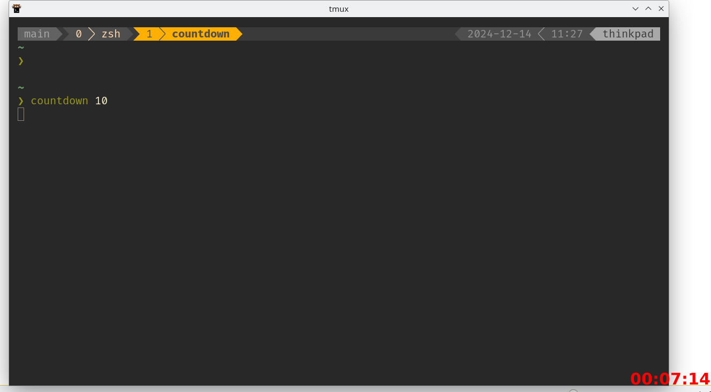

# Countdown App

This is a simple countdown app built with Go and Ebiten. The application allows you to set a countdown timer, which will be displayed in a floating window. Once the timer completes, the app will terminate. It's a lightweight utility that can be installed and run locally.

**Note**: 95% of this code was written with the assistance of ChatGPT.

## Features



- Set a countdown timer in minutes.
- Displays the remaining time in hours, minutes, and seconds.
- A transparent window with minimal UI, ideal for overlay use.
- The application is windowless (no borders, no title bar).
- Once the countdown is complete, the app will automatically exit.

## Prerequisites

Before you begin, ensure that you have the following installed on your system:

- **Go** (version 1.18 or newer)
- **Ebiten** (for window management and rendering)
- A font like **DejaVu Sans** (or another font of your choice)

### Install Go

You can download and install Go from the [official website](https://golang.org/dl/).

### Install Dependencies

To ensure you have all the required dependencies, run the following command:

```bash
go mod tidy
```

This will fetch all the necessary dependencies for the project.

### Install and Compile with Make

To build and install the app, simply run:

```bash
make
```

## Usage

[Provide specific instructions on how to use the app, set the timer, etc.]

```bash
countdown minutes
countdown 10
countdown 160
```
